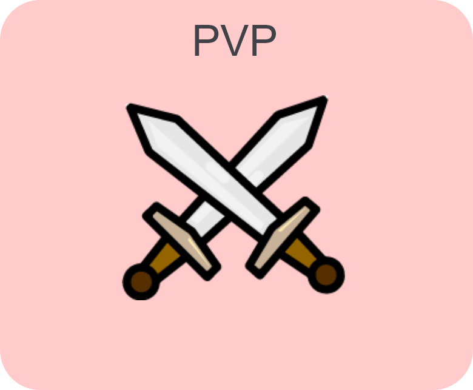
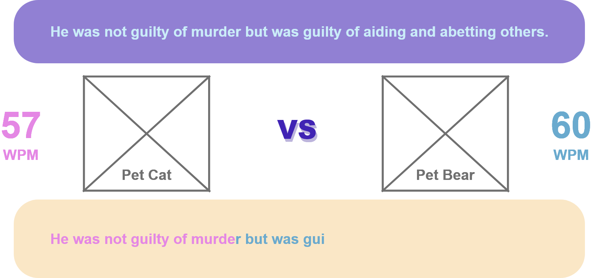

# **KEYBOARD WARRIORS**

### Members:
Team Leader & Scrum Master: Esther Ho Enqi (S10203310) 
Team  & Scrum Manager: Celest Goh Zi Xuan (S10204547)
 
Website: https://takoyakiisgood.github.io/Integrated-Project-ESCEL/
Github: https://github.com/Takoyakiisgood/Integrated-Project-ESCEL
 
## **Design Process**
Our project is catered for mainly people who are starting to use a computer, especially children around the ages of 6 to 12. This website application feature is to help them to practise typing so that in the future, they would be skilled at typing smoothly with little to no errors.
 
We came out with this idea with the thought that the generation is rapidly growing into the digital age and with more and more people required in the field of technology, there would be a need to lay down a good foundation on how to use a computer's keyboard. We noticed that in the past generation, when adults did not have a computer to practice typing, they are generally slower at typing with little efficiency. We want to help others learn how to type faster with more accuracy simultaneously. With many employers looking out for candidates that can type fast and accurately, this skill would increase the chances of employment since typing fast can increase productivity. 
 
In the adventure mode, we created a fictional world where the world was taken over by robot monsters, who have also store the eggs of many robot pets. Players, as heros, would have to rescue these robot pets from the robot monsters. By winning and defeating these monsters, players would get more and more experience points and level up, climbing the leaderboard. They might also get to collect eggs that were stolen by the robot monsters and evolve them to robot pets. 
 
In the player versus player (PVP) mode, players can challenge a random player of a similar level to see who can type the fastest and the most accurate. This will also help them to gain experience points and level up.
 
For those who do not sign up and log in to play, they would be known as a guest but still be able to type and play. However, their data and details would not be stored and cannot compare themselves on the leaderboard.
 
 
## **User Stories**
As a parent of a child who is 4 years old, I would like a website application that can help my children to type more efficiently and quickly in the future while at the same time having fun so that they can be productive in typing in the future when they require to use computers and laptops.

As a student, I would like to compete with my friends at school to see who can type the fastest with the least mistakes so we can see who types the best.

As a student, I would like to improve my typing so that in the future, I can complete my assignments with little difficulty typing even though most assignments were on pen and paper.
## **Features**
### **Existing Features**
These are all the features that are existing in our website application with images alongside it for visual representation of our features.
#### Navigation Bar:
This would allow players to move around the website easily and efficiently without being confused. This feature will lead players to the home page, the leaderboards page, the help page, the play page and the login page.
 

 
#### Logging In & Signing Up:
This would allow players to move around the website easily and efficiently without being confused. This feature will lead players to the home page, the leaderboards page, the help page, the play page and the login page.
 

 
### Leaderboard:
A leaderboard allows players to compare their scores with other players to see who is at a higher rank. The leaderboard will state their levels, the number of robot monsters they defeated and the number of robot pets they have evolved.
 

 
### Gamemodes:
This shows the available gamemode the player is allowed to play. There are two game modes, Player versus player (PVP) and Adventure. 
 
### Player versus player (PVP) gamemode:
This game mode allows players to go against other players in a typing tournament. This would help other players to rank up against other players in terms of leaderboards. This is the screen when a player selects to play the PVP mode. Here, the player will be challenging another player to see who can type the fastest with the least mistakes. The players would have their words per minute and the time counting down.
 

 
### Adventure gamemode:
This game mode allows players to defeat robots monsters that have a low chance of dropping robot pets that players could evolve and showcase in the leaderboard and their profile. Players would then gain experience points from killing the robot monsters and through that, they can level up. 
 

 
 
 
## **Features Left to Implement**
 
There are a few features that we have considered to add inside our website application feature but did not have enough time to accomplish them. We have listed all the features that were left to implement.
 
### Unique Identity:
We plan to add in a feature that would require users to sign up with unique passwords and usernames so that it would be much more secure. This is so that our website application feature would be kept safe.
 
### Unique Profile Pictures: 
We also plan on adding a feature that would allow users to upload their own profile picture instead of choosing from the default pictures that we allocated to them which are our game's mascots, robot pet cat and robot monster bear.
 
### Verification Process: 
We also plan to make the user information even more secure by allowing the users to verify themselves through their emails in order to confirm that they are 
 
## **Another feature idea**
 
We used English as the main language of our website application because English is one of the most commonly spoken languages in the world besides Chinese and Spanish. We wanted to train the younger generation to improve typing in general wit 
Technologies Used
In this section, you should mention all of the languages, frameworks, libraries, and any other tools that you have used to construct this project. For each, provide its name, a link to its official site and a short sentence of why it was used.
 
## JQuery:
The project uses JQuery to simplify DOM manipu We added datatables to tabulate the scores of players onto the leaderboard.
The number of robot monsters defeated, robot pets evolved and levels would be recorded onto datatables.
The datatables are to simplify the tables required to assemble and organise the scores.
Testing
For any scenarios that have not been automated, test the user stories manually and provide as much detail as is relevant. A particularly useful form for describing your testing process is via scenarios, such as:
 
## Contact form:
Developers: Esther Ho (s10203310@connect.np.edu.sg) & Celest Goh (s10204547@connect.np.edu.sg)
 
 
## Credits:
### Content:
In our design process, there was a statement heavily inspired by another typing test game that is currently on the Internet as of today, TypeRush. I was inspired by the statement in their main page," Nowadays many employers are requiring candidates to be able to type at least a minimum of 35 wpm just for the sake of productivity. There are a variety of reasons that employers are looking for people with above average keyboarding skills." 
### Media:
The photos used in this website application were obtained from mainly Google.**Another
 
#### Sword icon under to PVP title:
https://images.app.goo.gl/TaybdztKUhUb57PbA
 
#### Treasure map for Adventure 
####
 
### Acknowledgements: 
TypeRush: https://www.typerush.com/
10 Fast Fingers: https://10fastfingers.com/typing-test/english
Live Chat: https://www.livechat.com/typing-speed-test/#/

