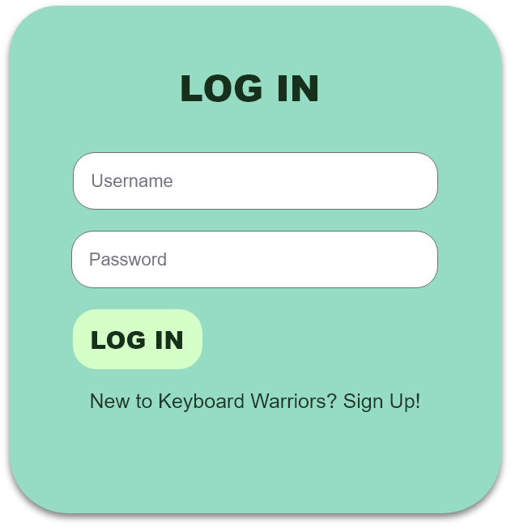

# **KEYBOARD WARRIORS**

### Members:
Team Leader & Scrum Master: Esther Ho Enqi (S10203310) 
Team  & Scrum Manager: Celest Goh Zi Xuan (S10204547)
 
Website: https://takoyakiisgood.github.io/Integrated-Project-ESCEL/ 
Github: https://github.com/Takoyakiisgood/Integrated-Project-ESCEL  
Adobe XD: https://xd.adobe.com/view/8e9419d2-a367-454f-816c-6c9f5d5b9ca5-dbc7/
 
## **Design Process**
Our project is catered for mainly people who are starting to use a computer, especially children around the ages of 6 to 12. This website application feature is to help them to practise typing so that in the future, they would be skilled at typing smoothly with little to no errors.
 
We came out with this idea with the thought that the generation is rapidly growing into the digital age and with more and more people required in the field of technology, there would be a need to lay down a good foundation on how to use a computer's keyboard. We noticed that in the past generation, when adults did not have a computer to practice typing, they are generally slower at typing with little efficiency. We want to help others learn how to type faster with more accuracy simultaneously. With many employers looking out for candidates that can type fast and accurately, this skill would increase the chances of employment since typing fast can increase productivity. 
 
In the adventure mode, we created a fictional world where the world was taken over by robot monsters, who have also store the eggs of many robot pets. Players, as heros, would have to rescue these robot pets from the robot monsters. By winning and defeating these monsters, players would get more and more experience points and level up, climbing the leaderboard. They might also get to collect eggs that were stolen by the robot monsters and evolve them to robot pets. 

We used English as the main language of our website application because English is one of the most commonly spoken languages in the world besides Chinese and Spanish. We wanted to train the younger generation to improve typing in general with the computer keyboard. 
 
## **User Stories**
As a parent of a child who is 6 years old, I would like a website application that can help my children to type more efficiently and quickly in the future while at the same time having fun so that they can be productive in typing in the future when they require to use computers and laptops.

As a student, I would like to compete with my friends at school to see who can type the fastest with the least mistakes so we can see who types the best.

As a student, I would like to improve my typing so that in the future, I can complete my assignments with little difficulty typing even though most assignments were on pen and paper.
## **Features**
### **Existing Features**
These are all the features that are existing in our website application with images alongside it for visual representation of our features.
#### Navigation Bar:
This would allow players to move around the website easily and efficiently without being confused. This feature will lead players to the home page, the leaderboards page, the help page, the play page and the login page.
 

 
#### Logging In & Signing Up:
The login function and signing up function is put in place so that the system can store player progress so that they can see their progress up the leaderboard or simply go back to where they left off at collecting the pet eggs.
 

 
### Leaderboard:
A leaderboard allows players to compare their scores with other players to see who is at a higher rank. The leaderboard will state their levels, the number of robot monsters they defeated and the number of robot pets they have evolved as well as their fastest words per minute.
 

 
 ### Adventure gamemode:
This game mode allows players to defeat robots monsters where players have to clear 3 rounds of typing. In each round of typing, there will be randomly generated sentences that players would have to follow and type correctly otherwise the monster would have the opportunity to attack the player instead. (1 Error = -1 HP) The sentences generated have different levels of difficulty based on the player’s level (Easy: level 15 and below, Medium: level 30 and below, Hard: above level 30). When players defeat a Monster, they gain 5 EXP. At level 1, they will need 15 EXP to level up, and an additional 5 EXP each time they level up. (E.g. level 2: 20 EXP, level 3: 25 EXP etc.). Players can also see their words per minute during each round to see if they have improved their typing skills.
 
When players defeat monsters there is a 20% chance that the monster will drop a pet egg. Pet eggs can be grown and evolved into pets that would be displayed in the home page. In order to grow the pet, players have to defeat monsters to gain egg EXP. When  players defeat a Monster, they gain 5 egg EXP.
 
 

### Home page
The home page is where user information is displayed (You will need to login to see the information otherwise information displayed would be "Guest"). The home page displays the username, date joined, level, monsters defeated, pets evolved, fastest wpm as well as exp levels. Players can also choose from 2 of the default profile pictures which is the bear profile pic and the cat profile pic.  
Other than user information, the home page displays user inventory as well, showing the number of eggs players have collected and also the fully evolved pets they own. They can click on the "Grow" button which would appear when you hover your mouse over the egg to start the growing process.  

## **Features Left to Implement**
 
There are a few features that we have considered to add inside our website application feature but did not have enough time to accomplish them. We have listed all the features that were left to implement.
 
### Unique Identity:
We plan to add in a feature that would require users to sign up with unique passwords and usernames so that it would be much more secure. This is so that our website application feature would be kept safe.
 
### Unique Profile Pictures: 
We also plan on adding a feature that would allow users to upload their own profile picture instead of choosing from the default pictures that we allocated to them which are our game's mascots, robot pet cat and robot monster bear.
 
### Verification Process: 
We also plan to make the user information even more secure by allowing the users to verify themselves through their emails in order to confirm that they are the user themself.

### PVP Mode: 
We also plan to have a PVP mode where players can compete against players of similar levels to train their speed and accuracy in typing such that there is competition and stress factor of the other player typing faster than themselves.

## JQuery:
The project uses JQuery to simplify DOM manipulation.

## DataTables:
The project also uses datatables to tabulate the scores of players onto the leaderboard. (number of robot monsters defeated, robot pets evolved and levels and wpm are recorded in the datatables.). The usage of datatables are to simplify process of assembling and organising of the scores.
## Bootstrap:
The project uses Bootstrap to simplify CSS Styling.
## Testing:
For any scenarios that have not been automated, test the user stories manually and provide as much detail as is relevant. A particularly useful form for describing your testing process is via scenarios, such as:
# Testing using Lambdatest.com:
Working fine on: Chrome, Firefox, Safari, Edge.  

1.Login form:
<li>Go to "Login" Page</li>
<li>Try logging in with invalid username and password and verify that error message of invalid username/password appears</li>
<li>Try logging in with valid username and password and verify that success message appears and user would be redirected to home page in 3 secs.</li>  
Some Issues not addressed:  
<li>Form does not have validation for submitting empty form</li> 

2.Register form:
<li>Register with new username and password and ensure register success message appears.</li>
Some Issues not addressed:  
<li>Form does not have validation for submitting empty form</li>
<li>After registering, players have to immediately login for the app to work normally. If they finish registering and immediately press the other tabs they would encounter an error where in the adventure mode startscreen they can not load the game page after ressing enter multiple times.</li> 

3.Navigation bar:
<li>Go from page to page via navigation bar</li>
<li> Ensure user is redirected to the correct webpage through the navigation bar.</li>
 Some issues not adressed:  
 <li>An if function was created that when players are logged in, the login tab on the navigation bar would be disabled for all pages until the user logs out. However the the login tab on the navigation bar from home page although shown as disabled can still be clicked to go to the login page.</li> 

 4.Play:
<li>Go to play page.</li>
<li>Select adventure mode.</li>
<li>Press enter when startscreen is shown ensure that lottie animation is running smoothly.</li>
<li>Type in the generated sentences and if clear show victory page if lose show defeat page.</li>
<li>If level up then ensure data is saved and uploaded to database.</li>

## Contact Us:
Developers: Esther Ho (s10203310@connect.np.edu.sg) & Celest Goh (s10204547@connect.np.edu.sg)
 
## Credits:
### Content:
In our design process, there was a statement heavily inspired by another typing test game that is currently on the Internet as of today, TypeRush. I was inspired by the statement in their main page," Nowadays many employers are requiring candidates to be able to type at least a minimum of 35 wpm just for the sake of productivity. There are a variety of reasons that employers are looking for people with above average keyboarding skills." 
### Media:
The photos used in this website application were obtained from mainly Google.
#### Treasure map for Adventure:
https://image.flaticon.com/icons/png/512/1643/1643169.png
 
### Acknowledgements: 
TypeRush: https://www.typerush.com/  
10 Fast Fingers: https://10fastfingers.com/typing-test/english  
Live Chat: https://www.livechat.com/typing-speed-test/#/

