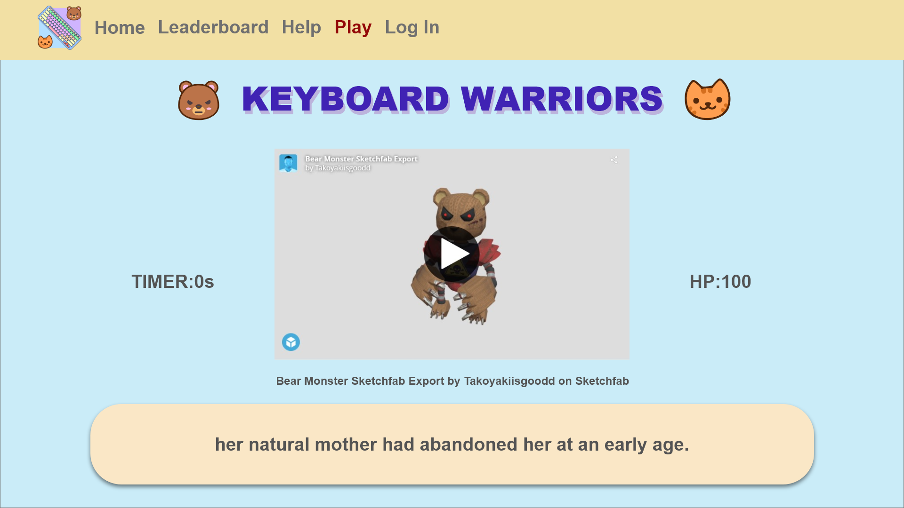

# **KEYBOARD WARRIORS**
Website: https://takoyakiisgood.github.io/Integrated-Project-ESCEL/
Github: https://github.com/Takoyakiisgood/Integrated-Project-ESCEL
## **Design Process**
Our project is catered for mainly people who are starting to use a computer, especially children around the ages of 6 to 12. This website application feature is to help them to practise typing so that in the future, they would be skilled at typing smoothly with little to no errors.

We came out with this idea with the thought that the generation is rapidly growing into the digital age and with more and more people required in the field of technology, there would be a need to lay down a good foundation on how to use a computer's keyboard. We noticed that in the past generation, when adults did not have a computer to practice typing, they are generally slower at typing with little efficiency. We want to help others learn how ot type faster with more accurancy simultaneously. With many employers looking out for candidates that can type fast and accurately, this skill would increase the chances of employment since typing fast can increase productivity. 

## **User Stories**
In particular, as part of this section we recommend that you provide a list of User Stories, with the following general structure:

As a user type, I want to perform an action, so that I can achieve a goal.
This section is also where you would share links to any wireframes, mockups, diagrams etc. that you created as part of the design process. These files should themselves either be included as a pdf file in the project itself (in an separate directory) Include the Adobe XD wireframe as a folder. You can include the XD share url.

## **Features**
### **Existing Features**
These are all the features that are existing in our website application with images alongside it for visual representation of our features.
#### Navigation Bar:
This would allow players to move around the website easily and efficiently without being confused. This feature will lead players to the home page, the leaderboards page, the help page, the play page and the log in page.

### Gamemode:
This shows the available gamemode the player is allowed to play. There are two game modes, Player versus player (PVP) and Adventure. 

### Player versus player (PVP) gamemode:
This game mode allows players to go against other players in a typing tournament. This would help other players to rank up against other players in terms of leaderboards. 

### Adventure gamemode:
This game mode allows players to defeat monsters that have a low chance of dropping pets that players could evolve and showcase in the leaderboard and their profile.

### Leaderboard:
A leaderboard allows players to compare their scores with other players to see who is at a higher rank. The leaderboard will state their levels, the number of monsters they defeated and 

Feature 1 - allows users X to achieve Y, by having them fill out Z
...
In addition, you may also use this section to discuss plans for additional features to be implemented in the future:

### **Features Left to Implement**
There are a few features that we have considered to add inside our website application feature but did not have enough time to accomplish them. We have listed all the features that were left to implement.

We plan to add in a feature that would require users to sign up with unique passwords and usernames so that it would be much more secure.
We also plan on adding a feature that would allow users to upload their own profile picture instead of choosing from the default pictures that we allocated to them which are our game's mascots, robot pet cat and robot monster bear.
We also plan to make the user information even more secure by allowing the users to verify themselves through their emails in order to confirm that they are 

Another feature idea
Technologies Used
In this section, you should mention all of the languages, frameworks, libraries, and any other tools that you have used to construct this project. For each, provide its name, a link to its official site and a short sentence of why it was used.

JQuery
The project uses JQuery to simplify DOM manipulation.
Testing
For any scenarios that have not been automated, test the user stories manually and provide as much detail as is relevant. A particularly useful form for describing your testing process is via scenarios, such as:

## Contact form:
Developers: Esther Ho (estherhoeq03@gmail.com) & Celest Goh (s10204547@connect.np.edu.sg)
Go to the "Contact Us" page
Try to submit the empty form and verify that an error message about the required fields appears
Try to submit the form with an invalid email address and verify that a relevant error message appears
Try to submit the form with all inputs valid and verify that a success message appears.
In addition, you should mention in this section how your project looks and works on different browsers and screen sizes.

You should also mention in this section any interesting bugs or problems you discovered during your testing, even if you haven't addressed them yet.

If this section grows too long, you may want to split it off into a separate file and link to it from here.

Credits
Content
The text for section Y was copied from the Wikipedia article Z
Media
The photos used in this site were obtained from ...
Acknowledgements
I received inspiration for this project from X